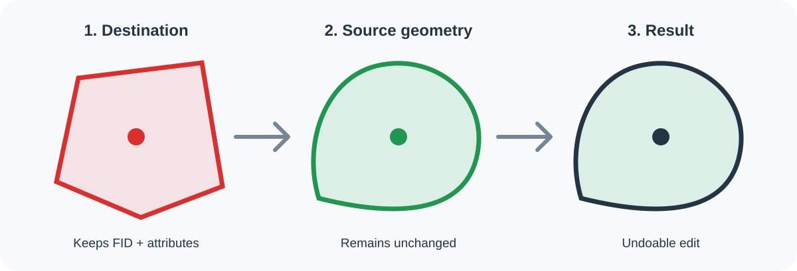

# Replace geometry with two clicks

[](https://qgis.org/)
[](LICENSE)
[](https://github.com/motacj/qgis_sustituir_geometria/actions/workflows/validate.yml)

QGIS plugin that replaces the geometry of a first clicked feature with the
geometry of a second clicked feature. The first feature keeps its feature ID
and every attribute; the second feature is never modified.



## Use

1. Click **Replace geometry with two clicks** in the toolbar or the **Vector**
   menu.
2. Click the destination feature. It is highlighted in red and will keep its
   feature ID and attributes.
3. Click the source feature. Its geometry is highlighted in green and will be
   copied.
4. Review the summary and confirm.
5. Inspect the result, then use the standard QGIS **Save Layer Edits**,
   **Undo**, or **Rollback** action.

The two features may belong to the same layer or to different visible vector
layers. They must share the same geometry family: point, line, or polygon. When
their layers use different coordinate reference systems, the source geometry
is transformed to the destination layer CRS. If several features overlap the
click position, the plugin asks the user to choose one explicitly.

## Editing safeguards

- Only the destination geometry is changed.
- The destination feature ID and stored attributes are preserved.
- The source feature remains unchanged.
- The operation is added to the QGIS edit buffer as one undoable command.
- The plugin never calls `commitChanges()` and never saves edits automatically.
- Right-click or press **Esc** to reset the selection.
- All temporary map highlights disappear when the tool is cancelled or closed.

## Requirements

- QGIS 3.28 to 3.99 (reference version: QGIS 3.44.2).
- A destination vector layer whose data provider supports editing.
- No external Python dependency, account, or network connection.

## Install from ZIP

1. Download `qgis_sustituir_geometria.zip` from the latest release.
2. Open **Plugins → Manage and Install Plugins → Install from ZIP**.
3. Select the ZIP, install it, and enable the plugin.

## Development and validation

```bash
python -m unittest discover -s tests -v
python tools/build_plugin.py
python tools/validate_package.py dist/qgis_sustituir_geometria.zip
```

The repository workflow runs the tests, compiles every Python source, builds
the QGIS package, validates its structure, and stores the ZIP as a workflow
artifact. See [PUBLICACION_QGIS.md](PUBLICACION_QGIS.md) for the release and
official repository checklist.

## Privacy and license

The plugin works entirely inside QGIS, sends no telemetry, and performs no
network request. See [PRIVACY.md](PRIVACY.md).

Licensed under the GNU General Public License, version 2 or later
([GPL-2.0-or-later](LICENSE)).

---

## Español

Complemento para QGIS que sustituye la geometría de una entidad conservando su
identificador y todos sus atributos.

### Funcionamiento

1. Pulsa **Sustituir geometría mediante dos clics** en la barra de herramientas
   o en el menú **Vector**.
2. Haz el primer clic sobre la entidad de destino. Esta conservará su FID y
   todos sus atributos y aparecerá resaltada en rojo.
3. Haz el segundo clic sobre la entidad cuya geometría deseas copiar. Aparecerá
   resaltada en verde.
4. Revisa el resumen y confirma la operación.
5. Comprueba el resultado y utiliza **Guardar ediciones**, **Deshacer** o
   **Descartar cambios** desde QGIS.

La segunda entidad permanece intacta. Las entidades pueden pertenecer a la
misma capa o a capas distintas, siempre que sean de la misma familia geométrica.
El complemento transforma el CRS cuando sea necesario, permite escoger entre
entidades superpuestas y adapta geometrías simples o múltiples al tipo exacto
de la capa de destino cuando la conversión no produce pérdida.

La capa de destino se pone en edición cuando es necesario, pero el complemento
no confirma ni guarda los cambios. Pulsa **Esc** o el botón derecho para cancelar
la selección.

Incidencias y propuestas:
[GitHub Issues](https://github.com/motacj/qgis_sustituir_geometria/issues).
